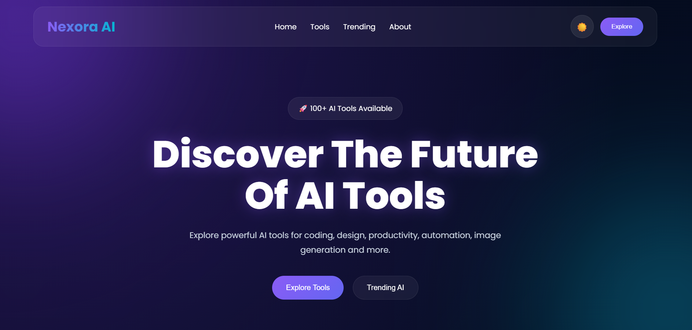
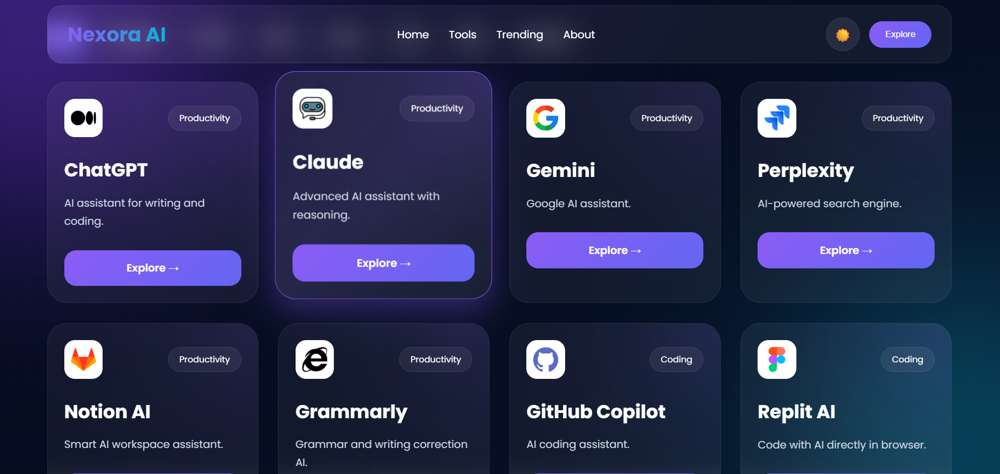
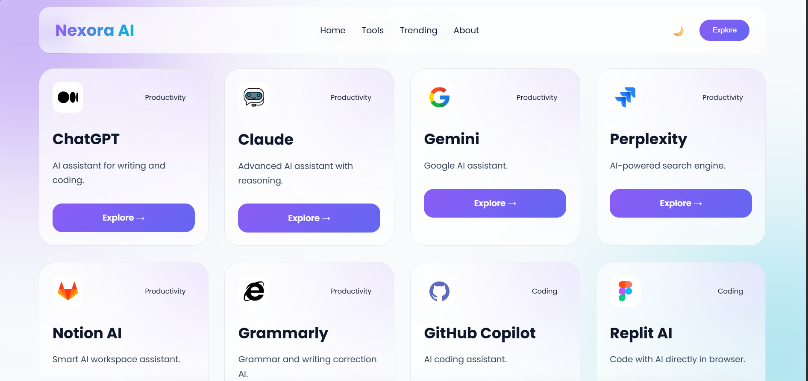
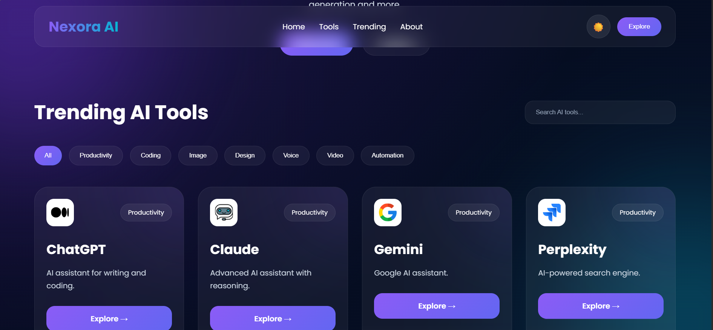
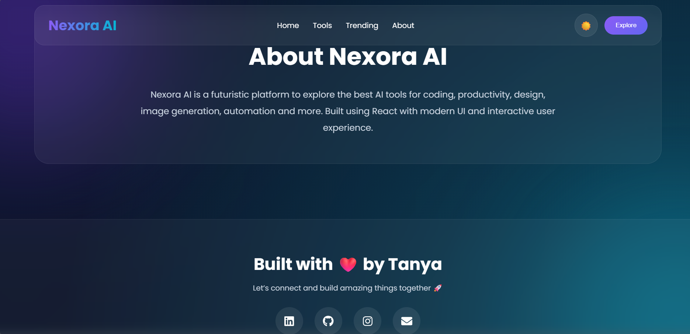

# 🚀 Nexora AI

<div align="center">

### 🌌 Discover. Explore. Experience the Future of AI.

🔗 **Live Website:**  
https://tanyav-rshney.github.io/nexora-ai/

</div>

---

# ✨ About The Project

Nexora AI is a futuristic AI tools discovery platform built using **React.js** and **Vite**.  
It helps users explore trending AI tools across multiple categories like productivity, coding, image generation, design, automation, voice AI, and more.

The project features a modern glassmorphism UI, dark/light theme, category filtering, search functionality, smooth interactions, and interactive user experience.

---

# 🌟 Features

✅ Search AI tools instantly  
✅ Category-based filtering  
✅ Dark / Light mode  
✅ Futuristic modern UI  
✅ Smooth scrolling navigation  
✅ Functional AI tool links  
✅ Interactive tool cards  
✅ Personal branding section  
✅ Fully deployed on GitHub Pages  

---

# 🛠️ Tech Stack

- React.js
- Vite
- CSS3
- React Icons
- GitHub Pages

---

# 📸 Project Preview

## 🏠 Homepage



---

## 🎨 Dark Mode



---

## ☀️ Light Mode



---

## 🧠 Category Filtering



---

## 👩‍💻 Footer / Connect Section



---

# 🌐 Live Demo

👉 https://tanyav-rshney.github.io/nexora-ai/

---

# 👩‍💻 About The Creator

Hi, I'm **Tanya Varshney** — a BCA student and aspiring frontend developer passionate about building modern, futuristic, and creative web experiences using React.js.

---

# 🤝 Connect With Me

### 💼 LinkedIn
https://www.linkedin.com/in/tanya-varshney-069839348/

### 💻 GitHub
https://github.com/Tanyav-rshney

### 📸 Instagram
https://www.instagram.com/tanyav_rshney102/

---

# 🚀 Run Locally

```bash
npm install

npm run dev
````

---

# ⭐ Project Status

✅ Live
✅ Functional
✅ Responsive
✅ Deployed Successfully

---

<div align="center">

## 💖 Built with passion by Tanya

</div>

